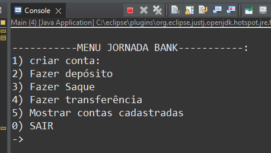
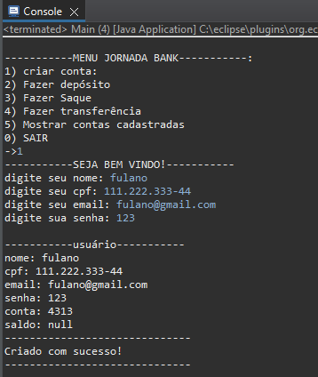
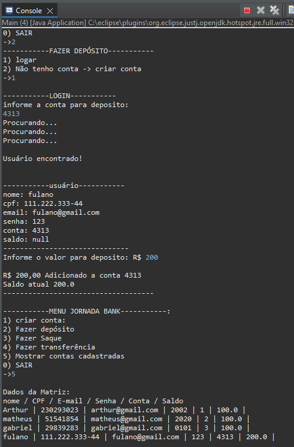

# JornadaBank

  Olá, aqui será explicado o funcionamento de todo o projeto Jornada Bank inteiramente desenvolvido somente com paradigma procedural em Java, 
seu armazenamento de dados somente em matrizes, aplicação de CRUD e métodos! 

  <h1> Menu </H1>
  Assim que o código for executado ele estará em looping para mostrar seu menu constantemente até o usuário desejar sair, e dentro deste menu há opções
que o usuário poderá escolher, dentre elas:   

  

  <h1> Criar usuário </H1>
  Para a facilitação de uso dos demais métodos e não serem criados vários usuários para serem feitos testes de saque, depósito, saque e principalmente transferência,
  foi já predefinido algumas posições e seus valores, mas para a utilização do método de criar conta foi deixado uma linha inteira em nulo para serem inseridos os dados
  do usuário. Caso o usuário deseje criar será solicitado seus dados de cadastro.  

  

  <h1> Fazer depósito </H1>
  Para ser feito o depósito, será perguntado ao usuário se ele já tem conta, senão, irá direcionar para o método anterior de criar conta. Após essa verificação será utilizado um método auxiliar para percorrer a matriz e encontrar a conta correspondente que quando encontrado irá retornar "usuário encontrado" e um valor como indice para ser inserido
  o valor desejado, caso durante esse looping não seja encontrado irá retornar "procurando...", e caso não exista a conta informada dentro da matriz irá retornar "Usuário não encontrado".

  

