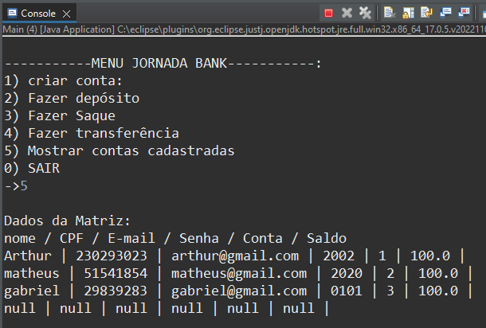
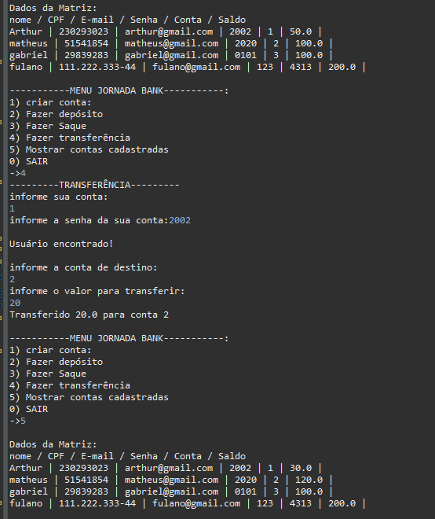
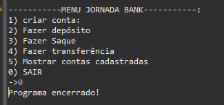

# 👨🏻‍💻 JornadaBank

  Olá, aqui será explicado o funcionamento de todo o projeto Jornada Bank inteiramente desenvolvido somente com paradigma procedural em Java, 
seu armazenamento de dados somente em matrizes, aplicação de CRUD e métodos! 

  <h1>📓 Menu </H1>
  Assim que o código for executado ele estará em looping para mostrar seu menu constantemente até o usuário desejar sair, e dentro deste menu há opções
que o usuário poderá escolher, dentre elas:   

  

  <h1>🎲 Mostrar matriz </H1>
  Este método é utilizado diversas vezes dentro da execução do código como uma forma visual para facilitar a manipulação dos dados, realizar consultas e testes.

  

  <h1>👤 Criar usuário </H1>
  Para a facilitação de uso dos demais métodos e não serem criados vários usuários para serem feitos testes de saque, depósito, saque e principalmente transferência,
  foi já predefinido algumas posições e seus valores, mas para a utilização do método de criar conta foi deixado uma linha inteira em nulo para serem inseridos os dados
  do usuário. Caso o usuário deseje criar será solicitado seus dados de cadastro.  

  

  <h1>💰 Fazer depósito </H1>
  Para ser feito o depósito, será perguntado ao usuário se ele já tem conta, senão, irá direcionar para o método anterior de criar conta. Após essa verificação será utilizado um método auxiliar para percorrer a matriz e encontrar a conta correspondente que quando encontrado irá retornar "usuário encontrado" e um valor como indice para ser inserido
  o valor desejado, caso durante esse looping não seja encontrado irá retornar "procurando...", e caso não exista a conta informada dentro da matriz irá retornar "Usuário não encontrado".
  Após isso, irá ser perguntado o valor a depositar e ele será incrementado no seu índice.

  

  <h1>💸 Fazer saque </H1>
  Quando o usuário desejar fazer um saque, novamente ira ser verificado se aquela conta existe E agora também irá ter uma validação de conta e senha correspondentes para ele acessar a conta se for dele mesmo. Após isso irá ser perguntado o valor a ser sacado e será decrementado em seu índice.

  

  <h1>💱 Fazer Transferência </H1>
  Novamente será perguntado conta e senha do usuário para caírem em uma validação, após ela ser verdadeira, será perguntado o número da conta de destino e o valor da transferência para transferir. Onde a conta logada pelo usuário será decrementado o valor de transferência e na conta de destino será incrementado este mesmo valor, retornando na tela seu valor de transferência e conta de destino.

  

  <h1>🏃 Sair </H1>
  Por fim, caso o usuário não deseje mais fazer nenhuma operação será encerrado o programa

  

<h1>🥳 OBRIGADO! 🥳</h1>
Desenvolvido por:  
🔰 Arthur dos Santos  
🔰 Matheus Cruz  
🔰 Gabriel Moura  

